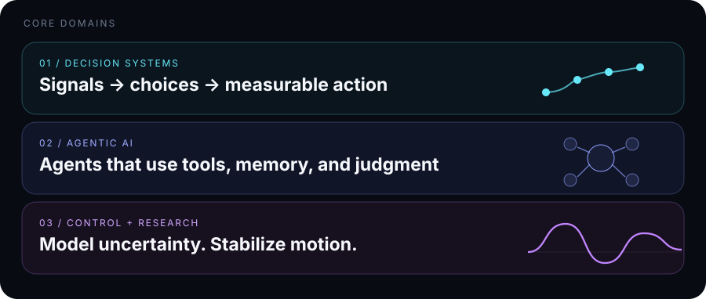
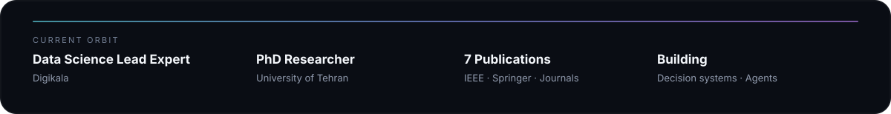
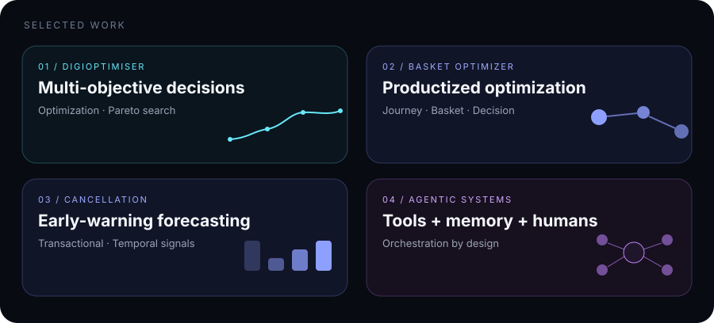
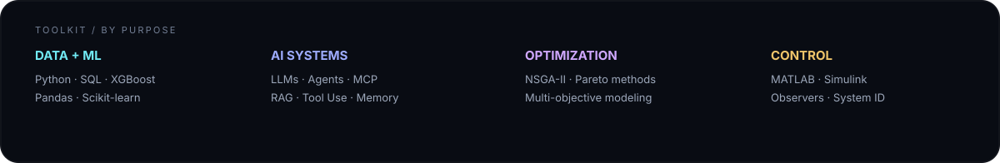

  

  <a href="https://ssuorena.github.io"><b>Portfolio</b></a>
  &nbsp;&nbsp;·&nbsp;&nbsp;
  <a href="https://www.linkedin.com/in/suorena-saeedi/"><b>LinkedIn</b></a>
  &nbsp;&nbsp;·&nbsp;&nbsp;
  <a href="https://scholar.google.com/citations?user=MNk66DoAAAAJ&hl=en"><b>Publications</b></a>

### Hey — I'm Suorena 

I build systems across **data, AI, optimization, and control**.

> **Observe → Model → Act**

 

  

  

  

  

  <a href="https://ssuorena.github.io"><b>Explore the full portfolio →</b></a>

  

  

  

  <b>Data × AI × Control</b> 
  Building intelligence that survives contact with the real world.

  <a href="mailto:ssuorena@gmail.com">Email</a>
  &nbsp;·&nbsp;
  <a href="https://www.linkedin.com/in/suorena-saeedi/">LinkedIn</a>
  &nbsp;·&nbsp;
  <a href="https://ssuorena.github.io">Portfolio</a>
  &nbsp;·&nbsp;
  <a href="https://github.com/ssuorena">GitHub</a>

