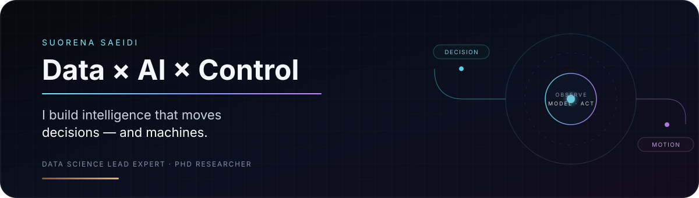

<p align="center">
  
</p>

<p align="center">
  <a href="https://ssuorena.github.io"><b>Portfolio</b></a>
  &nbsp;·&nbsp;
  <a href="https://www.linkedin.com/in/suorena-saeidi"><b>LinkedIn</b></a>
  &nbsp;·&nbsp;
  <a href="https://scholar.google.com/scholar?q=%22Suorena+Saeidi%22"><b>Publications</b></a>
</p>

<br/>


### Hey — I'm Suorena 

I build systems that sit between **data, AI, optimization, and control**.

By day, I work on decision systems in e-commerce.  
In research, I work on model-informed AI for friction and precision motion.

The common thread is simple:

> **Observe the system → model what matters → act with purpose.**

<br clear="right"/>

<p align="center">
  
</p>

## What I work on

<table>
<tr>
<td width="33%" valign="top">

### 01 · Decision Systems
Optimization, personalization, recommender systems, forecasting, experimentation.

**Typical question:**  
How do we turn noisy behavior into a better decision?

</td>
<td width="33%" valign="top">

### 02 · Agentic AI
LLM agents, tool use, MCP, RAG, memory, human-in-the-loop workflows.

**Typical question:**  
What should be autonomous — and what should stay deterministic?

</td>
<td width="33%" valign="top">

### 03 · Control & Research
System identification, friction modeling, observers, precision motion.

**Typical question:**  
How do we make a physical system behave predictably under uncertainty?

</td>
</tr>
</table>

## Current orbit

```text
DIGIKALA          → Data Science Lead Expert
UNIVERSITY OF TEHRAN → PhD Researcher
RESEARCH          → Model-informed AI × friction × precision motion
BUILDING          → Decision systems × agentic workflows
```

## Selected work

**DigiOptimiser**  
Multi-objective decision support using optimization and Pareto search.

**Customer Basket Optimizer**  
A productized optimization workflow around customer basket journeys.

**Cancellation Forecasting**  
Early-warning modeling using transactional and temporal signals.

**Agentic Systems**  
Tool-using AI workflows with memory, orchestration, and human checkpoints.

<p>
  <a href="https://ssuorena.github.io"><b>Explore the full portfolio →</b></a>
</p>

## Research signal

**PhD — Dynamics, Control & Vibrations · University of Tehran**

Model-informed AI for **sliding and pre-sliding friction** in precision motion systems.

`Stribeck` · `GMS` · `Model-Informed Neural Networks` · `Observers` · `Voice-Coil Actuation` · `Motion Control`

**7 publications** across IEEE, Springer, and academic journals.

## Toolkit — by purpose, not by logo count

| Layer | Tools / Methods |
|---|---|
| **Data & ML** | Python · SQL · Pandas · Scikit-learn · XGBoost · TensorFlow |
| **AI Systems** | LLMs · Agents · MCP · RAG · Tool Use · Human-in-the-loop |
| **Optimization** | NSGA-II · Multi-objective optimization · Game-theoretic modeling |
| **Control** | MATLAB · Simulink · System Identification · Observers · Motion Control |

## Recognition

`Magic Kudos — Digikala`  
`Third Best Paper — ICRoM 2021`  
`National Elite Foundation — Top Student Award`

<br/>

<p align="center">
  
</p>

<p align="center">
  <b>Data × AI × Control</b><br/>
  <sub>Building intelligence that survives contact with the real world.</sub>
</p>

<p align="center">
  <a href="mailto:ssuorena@gmail.com">Email</a>
  &nbsp;·&nbsp;
  <a href="https://www.linkedin.com/in/suorena-saeidi">LinkedIn</a>
  &nbsp;·&nbsp;
  <a href="https://ssuorena.github.io">Portfolio</a>
  &nbsp;·&nbsp;
  <a href="https://github.com/ssuorena">GitHub</a>
</p>
